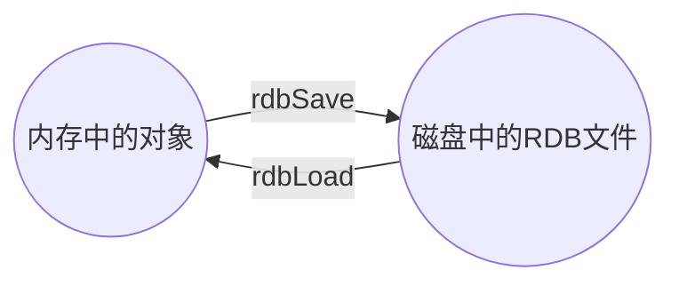

# redis教程

##	1. Redis的五大数据类型
- string（字符串）
- hash（哈希，类似java里的Map）
- list（列表）
- set（集合）
- zset(sorted set：有序集合)


- 哪里去获得redis常见数据类型操作命令
  - 官网：https://redis.io/commands
  - 菜鸟教程：https://www.runoob.com/redis/redis-tutorial.html
  - Redis命令参考：https://www.runoob.com/redis/redis-commands.html

### 1.1 Redis 键(key)

常用案例
* `keys *`
* `exists key的名字`，判断某个key是否存在
* `move key db`   --->当前库就没有了，被移除了
* `expire key 秒钟`：为给定的key设置过期时间 

在 Redis 中，当键过期后，Redis 会返回-2作为过期状态，然后在需要释放内存时才会将这个过期键删除。它只是延迟删除过期键以节省资源。

* `ttl key` 查看还有多少秒过期，-1表示永不过期，-2表示已过期
* `type key` 查看你的key是什么类型

### 1.2 Redis字符串(String)
常用, 单值单value 案例
* `set`/`get`/`del`/`append`/`strlen`
* `Incr`/`decr`/`incrby`/`decrby`,一定要是数字才能进行加减
  * ```redis
    incrby number 2
    ```
* `getrange`/`setrange`
  * `setrange` 给起始地址覆盖写入
* `setex`(set with expire)键秒值/`setnx`(set if not exist)
* `mset`/`mget`/`msetnx`
  * `mset`:同时设置一个或多个 `key-value` 对。
  * `mget`:获取所有(一个或多个)给定 `key` 的值。
  * `msetnx`:同时设置一个或多个 `key-value` 对，当且仅当所有给定 key 都不存在。
* `getset`(先get再set)

### 1.3 Redis列表(List)
常用,单值多value,案例
* `lpush`/`rpush`/`lrange`
* `lpop`/`rpop`
* lindex，按照索引下标获得元素(从上到下)
* llen
* lrem key 删N个value
* ltrim key 开始index 结束index，截取指定范围的值后再赋值给key
* rpoplpush 源列表 目的列表
* lset key index value
* linsert key  before/after 值1 值2
* 性能总结


### 1.4 Redis集合(Set)

> 单值多value

案例
* `sadd/smembers/sismember`
* `scard`，获取集合里面的元素个数
* `srem key value` 删除集合中元素
* `srandmember key` 某个整数(随机出几个数)
* `spop key` 随机出栈
* `smove key1 key2` 在key1里某个值      作用是将key1里的某个值赋给key2

数学集合类
* 差集：sdiff
* 交集：sinter
* 并集：sunion

### 1.5 Redis哈希(Hash)

> 常用, KV模式不变，但V是一个键值对

案例
- `hset/hget/hmset/hmget/hgetall/hdel`
- `hlen`
- `hexists key` 在key里面的某个值的key
- `hkeys/hvals`
- `hincrby/hincrbyfloat`
- `hsetnx`

### 1.6 Redis有序集合Zset(sorted set)

> 多说一句 在set基础上，加一个score值。 之前set是k1 v1 v2 v3， 现在zset是k1 score1 v1 score2 v2

案例
- `zadd/zrange [withscores]`
- `zrangebyscore key 开始score 结束score [withscores]`
  - (   不包含 
  - limit 作用是返回限制 limit 开始下标步 多少步

- `zrem key` 某score下对应的value值，作用是删除元素
- `zcard/zcount key score区间/zrank key values值`，作用是获得下标值/zscore key 对应值,获得分数
- `zrevrank key values`值，作用是逆序获得下标值
- zrevrange
- zrevrangebyscore  key 结束score 开始score

## 2 解析配置文件 `redis.conf`
### 2.1 地址
```shell
docker run \
	--log-opt max-size=100m \
	--log-opt max-file=2 \
	--network mybridge \
	--ip 172.22.1.63 \
	-p 6379:6379 \
	--name redis \
	-v /home/docker/redis/redis.conf:/etc/redis/redis.conf \
	-v /home/docker/redis/data:/data \
	-d redis \
	redis-server /etc/redis/redis.conf  \
	--appendonly yes
```

### 2.2 Units 单位

* 配置大小单位,开头定义了一些基本的度量单位，只支持bytes，不支持bit
* 对大小写不敏感

### 2.3 Include 包含

* 和我们的`Struts2`配置文件类似，可以通过`includes`包含， r`edis.conf`可以作为总闸，包含其他`.conf`文件
* 类似于`nginx.conf`

### 2.4 GENERAL通用

* Daemonize
* Pidfile
* Port
* Tcp-backlog
  1. tcp-backlog 设置tcp的backlog，backlog其实是一个连接队列. 
  2. backlog队列总和=未完成三次握手队列 + 已经完成三次握手队列。 
  3. 在高并发环境下你需要一个高backlog值来避免慢客户端连接问题。 
  4. 注意Linux内核会将这个值减小到`/proc/sys/net/core/somaxconn`的值，所以需要确认增大`somaxconn`和`tcp_max_syn_backlog`两个值
      来达到想要的效果.

* Timeout
  * 单位为秒，如果设置为0，则不会进行Keepalive检测，建议设置成60

* Bind
* Tcp-keepalive
  * 单位为秒，如果设置为0，则不会进行Keepalive检测，建议设置成60

* Loglevel
* Logfile
* Syslog-enabled
  * 是否把日志信息记录到系统日志中，默认是no
* Syslog-ident
  * 设置系统日志`syslog`中的日志标志
* Syslog-facility
  * 指定syslog设备，值可以是USER或LOCAL0-LOCAL7
* Databases

### 2.5 SNAPSHOTTING快照

* save 秒钟 写操作次数

  * save 900 1  //900秒后保存，要求至少有1个key被更改时才会触发
  * save 300 10 //300秒后保存，要求至少有10个key被更改时才会触发
  * save 60 10000   //60秒后保存，要求至少有10000个key被更改时才会触发
  * 禁用，如果想禁用RDB持久化的策略，只要不设置任何save指令，或者给save传入一个空字符串参数也可以。

* Stop-writes-on-bgsave-error：如果配置成no，表示你不在乎数据不一致或者有其他的手段发现和控制

* rdbcompression：对于存储到磁盘中的快照，可以设置是否进行压缩存储。如果是的话，redis会采用LZF算法进行压缩。如果你不想消耗CPU来进行压缩的话，可以设置为关闭此功能。

* rdbchecksum：在存储快照后，还可以让redis使用CRC64算法来进行数据校验，但是这样做会增加大约 10% 的性能消耗，如果希望获取到最大的性能提升，可以关闭此功能。

* dbfilename，数据库转储文件名字
* dir 指定数据库转储文件的存放目录

### 2.6 REPLICATION复制

### 2.7 SECURITY安全

```shell
127.0.0.1:6379>configget requirepassrequirepass
1) "requirepass"
2) "1"
127.0.0.1:6379>config set requirepass "123456"
OK
127.0.0.1:6379>config get requirepass
(error)NOAUTH Authentication required.
127.0.0.1:6379>auth 123456
OK
127.0.0.1:6379>get k1
"v1"
127.0.0.1:6379> config set requirepass
OK
127.0.0.1:6379> config get requirepass
1) "requirepass"
2) ""
127.0.0.1:6379>
```

### 2.8 LIMITS限制

* Maxclients

设置redis同时可以与多少个客户端进行连接。默认情况下为10000个客户端。

当你无法设置进程文件句柄限制时，redis会设置为当前的文件句柄限制值减去32，因为redis会为自身内部处理逻辑留一些句柄出来。

如果达到了此限制，redis则会拒绝新的连接请求，并且向这 些连接请求方发出“max number of clients reached”以作回应。


* Maxmemory

设置redis可以使用的内存量。

一旦到达内存使用上限，redis将会试图移除内部数据，移除规则可以通过maxmemory-policy来指定。

如果redis无法根据移除规则来移除内存中的数据，或者设置了“不允许移除”， 那么redis则会针对那些需要申请内存的指令返回错误信息，比如SET、LPUSH等。

但是对于无内存申请的指令，仍然会正常响应，比如GET等。如果你的redis是主redis（说明你的redis有从redis），那么在设置内存使用上限时，需要在系统中留出一些内存空间给同步队列缓存，只有在你设置的是“不移除”的情况下，才不用考虑这个因素.


* Maxmemory-policy

（1）volatile-lru：使用LRU算法移除key，只对设置了过期时间的键

（2）allkeys-lru：使用LRU算法移除key

（3）volatile-random：在过期集合中移除随机的key，只对设置了过期时间的键

（4）allkeys-random：移除随机的key

（5）volatile-ttl：移除那些TTL值最小的key，即那些最近要过期的key

（6）noeviction：不进行移除。针对写操作，只是返回错误信息

Maxmemory-samples
设置样本数量，LRU算法和最小TTL算法都并非是精确的算法，而是估算值，所以你可以设置样本的大小，

redis默认会检查这么多个key并选择其中LRU的那个

### 2.9 APPEND ONLY MODE

* appendonly: 指定是否开启 AOF 模式。当设置为 yes 时，Redis 将以追加方式记录每个写操作，以确保持久性。默认情况下为 no。
* appendfilename: 指定 AOF 文件的文件名。默认情况下为 appendonly.aof。
* appendfsync: 指定何时将 AOF 缓冲区中的写入操作刷新到磁盘。有三个选项可供选择：always（每个写入命令都会被立即写入磁盘）、everysec（每秒写入一次，这是默认值，通常在保证性能的同时提供了很好的持久性保障）、no（由操作系统决定何时进行写入）。always 提供最大的持久性保障，但可能会影响性能，而 everysec 则在保证相对良好的性能的同时提供了足够的持久性。
* no-appendfsync-on-rewrite: 设置为 no 时，表示在 AOF 重写时仍然使用 appendfsync。默认情况下为 no，这意味着在 AOF 重写期间，Redis 将继续使用 appendfsync 规则来刷新缓冲区。这样可以确保重写期间的数据安全性。
* auto-aof-rewrite-min-size: 设置 AOF 重写的最小文件大小。只有当 AOF 文件的大小至少达到此大小时，Redis 才会启动自动 AOF 重写。默认值为 64 MB。
* auto-aof-rewrite-percentage: 设置 AOF 重写的触发百分比。只有当当前 AOF 文件的大小超过上次重写时的大小的一定百分比时，Redis 才会启动自动 AOF 重写。默认值为 100（表示 AOF 文件大小达到上次重写时的大小时触发重写）。
* 通过调整这些选项，你可以根据你的需求来平衡 Redis 的性能和持久性。

### 2.10 常见配置redis.conf介绍
参数说明

redis.conf 配置项说明如下：
1. Redis默认不是以守护进程的方式运行，可以通过该配置项修改，使用yes启用守护进程
   daemonize no
2. 当Redis以守护进程方式运行时，Redis默认会把pid写入/var/run/redis.pid文件，可以通过pidfile指定
   pidfile /var/run/redis.pid
3. 指定Redis监听端口，默认端口为6379，作者在自己的一篇博文中解释了为什么选用6379作为默认端口，因为6379在手机按键上MERZ对应的号码，而MERZ取自意大利歌女Alessia Merz的名字
   port 6379
4. 绑定的主机地址
   bind 127.0.0.1
5. 当 客户端闲置多长时间后关闭连接，如果指定为0，表示关闭该功能
    timeout 300
6. 指定日志记录级别，Redis总共支持四个级别：debug、verbose、notice、warning，默认为verbose
   loglevel verbose
7. 日志记录方式，默认为标准输出，如果配置Redis为守护进程方式运行，而这里又配置为日志记录方式为标准输出，则日志将会发送给/dev/null
   logfile stdout
8. 设置数据库的数量，默认数据库为0，可以使用`SELECT <dbid>`命令在连接上指定数据库id
   databases 16
9. 指定在多长时间内，有多少次更新操作，就将数据同步到数据文件，可以多个条件配合
   `save <seconds> <changes>`
   Redis默认配置文件中提供了三个条件：
   `save 900 1`
   `save 300 10`
   `save 60 10000`
   分别表示900秒（15分钟）内有1个更改，300秒（5分钟）内有10个更改以及60秒内有10000个更改。

10. 指定存储至本地数据库时是否压缩数据，默认为yes，Redis采用LZF压缩，如果为了节省CPU时间，可以关闭该选项，但会导致数据库文件变的巨大
    rdbcompression yes
11. 指定本地数据库文件名，默认值为dump.rdb
    dbfilename dump.rdb
12. 指定本地数据库存放目录
    dir ./
13. 设置当本机为slav服务时，设置master服务的IP地址及端口，在Redis启动时，它会自动从master进行数据同步
    `slaveof <masterip> <masterport>`
14. 当master服务设置了密码保护时，slav服务连接master的密码
    `masterauth <master-password>`
15. 设置Redis连接密码，如果配置了连接密码，客户端在连接Redis时需要通过`AUTH <password>`命令提供密码，默认关闭
    requirepass foobared
16. 设置同一时间最大客户端连接数，默认无限制，Redis可以同时打开的客户端连接数为Redis进程可以打开的最大文件描述符数，如果设置 maxclients 0，表示不作限制。当客户端连接数到达限制时，Redis会关闭新的连接并向客户端返回max number of clients reached错误信息
    maxclients 128
17. 指定Redis最大内存限制，Redis在启动时会把数据加载到内存中，达到最大内存后，Redis会先尝试清除已到期或即将到期的Key，当此方法处理 后，仍然到达最大内存设置，将无法再进行写入操作，但仍然可以进行读取操作。Redis新的vm机制，会把Key存放内存，Value会存放在swap区
    maxmemory `<bytes>`
18. 指定是否在每次更新操作后进行日志记录，Redis在默认情况下是异步的把数据写入磁盘，如果不开启，可能会在断电时导致一段时间内的数据丢失。因为 redis本身同步数据文件是按上面save条件来同步的，所以有的数据会在一段时间内只存在于内存中。默认为no
    appendonly no
19. 指定更新日志文件名，默认为appendonly.aof
    appendfilename appendonly.aof
20. 指定更新日志条件，共有3个可选值：
    no：表示等操作系统进行数据缓存同步到磁盘（快）
    always：表示每次更新操作后手动调用fsync()将数据写到磁盘（慢，安全）
    everysec：表示每秒同步一次（折衷，默认值）
    appendfsync everysec

21. 指定是否启用虚拟内存机制，默认值为no，简单的介绍一下，VM机制将数据分页存放，由Redis将访问量较少的页即冷数据swap到磁盘上，访问多的页面由磁盘自动换出到内存中（在后面的文章我会仔细分析Redis的VM机制）
    vm-enabled no
22. 虚拟内存文件路径，默认值为/tmp/redis.swap，不可多个Redis实例共享
    vm-swap-file /tmp/redis.swap
23. 将所有大于vm-max-memory的数据存入虚拟内存,无论vm-max-memory设置多小,所有索引数据都是内存存储的(Redis的索引数据 就是keys),也就是说,当vm-max-memory设置为0的时候,其实是所有value都存在于磁盘。默认值为0
    vm-max-memory 0
24. Redis swap文件分成了很多的page，一个对象可以保存在多个page上面，但一个page上不能被多个对象共享，vm-page-size是要根据存储的 数据大小来设定的，作者建议如果存储很多小对象，page大小最好设置为32或者64bytes；如果存储很大大对象，则可以使用更大的page，如果不 确定，就使用默认值
    vm-page-size 32
25. 设置swap文件中的page数量，由于页表（一种表示页面空闲或使用的bitmap）是在放在内存中的，，在磁盘上每8个pages将消耗1byte的内存。
    vm-pages 134217728
26. 设置访问swap文件的线程数,最好不要超过机器的核数,如果设置为0,那么所有对swap文件的操作都是串行的，可能会造成比较长时间的延迟。默认值为4
    vm-max-threads 4
27. 设置在向客户端应答时，是否把较小的包合并为一个包发送，默认为开启
    glueoutputbuf yes
28. 指定在超过一定的数量或者最大的元素超过某一临界值时，采用一种特殊的哈希算法
    hash-max-zipmap-entries 64
    hash-max-zipmap-value 512
29. 指定是否激活重置哈希，默认为开启（后面在介绍Redis的哈希算法时具体介绍）
    activerehashing yes
30. 指定包含其它的配置文件，可以在同一主机上多个Redis实例之间使用同一份配置文件，而同时各个实例又拥有自己的特定配置文件
    include /path/to/local.conf

## 3. Redis 持久化
https://redis.io/docs/latest/operate/oss_and_stack/management/persistence/

### 3.1 RDB（Redis DataBase）

1. 是什么

    在指定的时间间隔内将内存中的数据集快照写入磁盘， 也就是行话讲的Snapshot快照，它恢复时是将快照文件直接读到内存里
    
    Redis会单独==创建（fork）==一个子进程来进行持久化，会先将数据写入到 一个临时文件中，待持久化过程都结束了，再用这个临时文件替换上次持久化好的文件。 整个过程中，主进程是不进行任何IO操作的，这就确保了极高的性能 如果需要进行大规模数据的恢复，且对于数据恢复的完整性不是非常敏感，那RDB方 式要比AOF方式更加的高效。RDB的缺点是最后一次持久化后的数据可能丢失。

2. fork

    Fork的作用是复制一个与当前进程一样的进程。新进程的所有数据（变量、环境变量、程序计数器等）
    数值都和原进程一致，但是是一个全新的进程，并作为原进程的子进程

3. Rdb 保存的是dump.rdb文件
4. 配置多久保存快照
5. 如何触发RDB快照
   - 配置文件中默认的快照配置
   - 命令save或者是 bgsave
     Save：save时只管保存，其它不管，全部阻塞
     BGSAVE：Redis会在后台异步进行快照操作，
     快照同时还可以响应客户端请求。可以通过lastsave 命令获取最后一次成功执行快照的时间
     
   - 执行flushall命令，也会产生dump.rdb文件，但里面是空的，无意义

6. 恢复rdb文件
   将备份文件 (dump.rdb) 移动到 redis 安装目录并启动服务即可

   CONFIG GET dir获取目录

7. rdb 优势
   - 适合大规模的数据恢复
   - 对数据完整性和一致性要求不高

8. rdb 劣势
    - 在一定间隔时间做一次备份，所以如果redis意外down掉的话，就会丢失最后一次快照后的所有修改
    - Fork的时候，内存中的数据被克隆了一份，大致2倍的膨胀性需要考虑
9. 如何停止

   动态所有停止RDB保存规则的方法：`redis-cli config set save ""`

10. 小总结

* 优势
  * RDB是一个非常紧凑的文件
  * RDB在保存RDB文件时父进程唯一需要做的就是fork出一个子进程,接下来的工作全部由子进程来做，父进程不需要再做其他IO操作，所以RDB持久化方式可以最大化redis的性能.
  * 与AOF相比,在恢复大的数据集的时候，RRDB方式会更快一些

* 缺点
  * 数据丢失风险大
  * RDB需要经常fork子进程来保存数据集到硬盘上,当数据集比较大的时候,fork的过程是非常耗时的,可能会导致Redis在一些毫秒级不能相应客户端请求（save模式？）

### 3.2 AOF（Append Only File）

1. 是什么

    以日志的形式来记录每个写操作，将Redis执行过的所有写指令记录下来(读操作不记录)。

   只许追加文件但不可以改写文件，redis启动之初会读取该文件重新构建数据，换言之，redis
   重启的话就根据日志文件的内容将写指令从前到后执行一次以完成数据的恢复工作
2. Aof保存的是appendonly.aof文件
3. 配置位置 redis.conf appendonly no,默认是no, yes 就是打开aof持久化

   AOF启动/修复/恢复
   - 正常恢复
     - 启动：设置Yes，修改默认的appendonly no，改为yes
     - 将有数据的aof文件复制一份保存到对应目录(config get dir)
     - 恢复：重启redis然后重新加载
     - 异常恢复
         - 启动：设置Yes，修改默认的appendonly no，改为yes
         - 备份被写坏的AOF文件
         - 恢复：重启redis，然后重新加载
         ```shell
         [root@c1oud bin]\# redis-server /usr/common/redis304/redis_new.conf
         [root@cloud bin]\# redis-c1i
         Cou1d not connect to Redis at 127.0.0.1:6379: Connection refused
         not connected> quit
         [root@cloud bin]\#
         ```
       Redis-check-aof --fix进行修复
     - 恢复：重启redis然后重新加载
4. Rewrite
   - 是什么

     AOF采用文件追加方式，文件会越来越大为避免出现此种情况，新增了重写机制,
     当AOF文件的大小超过所设定的阈值时，Redis就会启动AOF文件的内容压缩，
     只保留可以恢复数据的最小指令集.可以使用命令bgrewriteaof
   - 重写原理

     AOF文件持续增长而过大时，会fork出一条新进程来将文件重写(也是先写临时文件最后再rename)，

     遍历新进程的内存中数据，每条记录有一条的Set语句。重写aof文件的操作，<mark>并没有读取旧的aof文件</mark>， 而是将整个内存中的数据库内容用命令的方式重写了一个新的aof文件，这点和快照有点类似.
   - 触发机制

     Redis会记录上次重写时的AOF大小，默认配置是当AOF文件大小是上次rewrite后大小的一倍且文件大于64M时触发.
5. 优势
   - 每修改同步：appendfsync always   同步持久化 每次发生数据变更会被立即记录到磁盘  性能较差但数据完整性比较好
   - 每秒同步：appendfsync everysec    异步操作，每秒记录   如果一秒内宕机，有数据丢失
   - 不同步：appendfsync no   从不同步

6. 劣势

   - 相同数据集的数据而言aof文件要远大于rdb文件，恢复速度慢于rdb
   - aof运行效率要慢于rdb，每秒同步策略效率较好，不同步效率和rdb相同

7. 小总结

| adv                                                                          | disAdv                           |
|------------------------------------------------------------------------------|----------------------------------|
| AOF文件是一个只进行追加的日志文件                                                           | 对于相同的数据集来说，AOF文件的体积通常要大于RDB文件的体积 |
| Redis可以在AOF文件体积变得过大时，自动地在后台对 AOF进行重写                                         | 根据所使用的fsync策略，AOF的速度可能会慢于RDB     |
| AOF文件有序地保存了对数据库执行的所有写入操作，这些写入操作以Redis 协议的格式保存，因此AOF文件的内容非常容易被人读懂，对文件进行分析也很轻松 |                                  |

### 3.3 总结(Which one)

- RDB持久化方式能够在指定的时间间隔能对你的数据进行快照存储
- AOF持久化方式记录每次对服务器写的操作，当服务器重启的时候会重新执行这些命令来恢复原始的数据，AOF命令以Redis 协议追加保存每次写的操作到文件末尾.Redis还能对AOF文件进行后台重写,使得AOF文件的体积不至于过大.
- 只做缓存：如果你只希望你的数据在服务器运行的时候存在,你也可以不使用任何持久化方式.
- 同时开启两种持久化方式：在这种情况下，当redis重启的时候会优先载入AOF文件来恢复原始的数据，因为在通常情况下AOF文件保存的数据集要比RDB文件保存的数据集要完整.
- RDB的数据不实时，同时使用两者时服务器重启也只会找AOF文件。那要不要只使用AOF呢？
  作者建议不要，因为RDB更适合用于备份数据库(AOF在不断变化不好备份)，
  快速重启，而且不会有AOF可能潜在的bug，留着作为一个万一的手段。
- 性能建议 

    因为RDB文件只用作后备用途，建议只在Slave上持久化RDB文件，而且只要15分钟备份一次就够了，只保留save 900 1这条规则。
    
    如果Enalbe AOF，好处是在最恶劣情况下也只会丢失不超过两秒数据，启动脚本较简单只load自己的AOF文件就可以了。代价一是带来了持续的IO，二是AOF rewrite的最后将rewrite过程中产生的新数据写到新文件造成的阻塞几乎是不可避免的。只要硬盘许可，应该尽量减少AOF rewrite的频率，AOF重写的基础大小默认值64M太小了，可以设到5G以上。默认超过原大小100%大小时重写可以改到适当的数值。
    
    如果不Enable AOF ，仅靠Master-Slave Replication 实现高可用性也可以。能省掉一大笔IO也减少了rewrite时带来的系统波动。
    
    代价是如果Master/Slave同时倒掉，会丢失十几分钟的数据，启动脚本也要比较两个Master/Slave中的RDB文件，载入较新的那个。新浪微博就选用了这种架构
